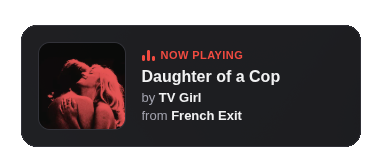
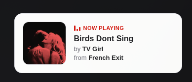

# Lastfm Widget

> ❤️ Powered by [lastfm-last-played - biancarosa](https://github.com/biancarosa/lastfm-last-played)

A widget to display your last listened to song on last.fm.

|              Dark                |                Light               |
| :------------------------------: | :--------------------------------: |
|  |  |

## How to use

- [Vanilla JS](#vanilla-js)
- [React](#react)

## Vanilla JS

### 1. Add the files

Copy `widget.css` and `widget.js` into your project.

### 2. Drop the widget into your page

Add a container element with the id `lastfm-widget`, then load the stylesheet and script:

```html
<link rel="stylesheet" href="/widget.css">

<div id="lastfm-widget"></div>

<script src="/widget.js"></script>
<script>loadWidget("auto", "username")</script> <!-- "light" | "dark" | "auto" | "bg" | "banner", your last.fm username -->
```

The widget refreshes automatically every 10 seconds. Pass a third argument to
`loadWidget` to change the interval (in milliseconds), or `0` to disable it:

```html
<script>loadWidget("auto", "username", 30000)</script> <!-- refresh every 30s -->
<script>loadWidget("auto", "username", 0)</script>     <!-- no auto-refresh -->
```

`loadWidget` returns the interval id, so you can stop refreshing later with
`clearInterval(id)`.

A minimal, complete page is available in [`widget-example.html`](widget-example.html).

## React

### 1. Add the files

Copy the component and `widget.css` into your project, use `LastfmWidget.tsx` for TypeScript or `LastfmWidget.jsx` for plain JavaScript. The component imports `widget.css` itself, so make sure the two files sit next to each other (or adjust the import path).

### 2. Render the component

```tsx
export default function App() {
    return <LastfmWidget username="username" theme="auto" />;
}
```

### Props

| Prop              | Type                            | Default    | Description                                                        |
| ----------------- | ------------------------------- | ---------- | ----------------------------------------------------------------- |
| `username`        | `string`                        | _required_ | Your last.fm username.                                            |
| `theme`           | `"light" \| "dark" \| "auto" \| "bg" \| "banner"` | `"auto"` | Color theme. `bg` and `banner` use the album cover as a darkened background (`banner` is a wider layout with extra padding on the right). |
| `refreshInterval` | `number`                        | `10000`    | Milliseconds between refreshes. Set to `0` to disable polling.    |

```tsx
<LastfmWidget username="username" refreshInterval={30000} /> // refresh every 30s
<LastfmWidget username="username" refreshInterval={0} />     // no auto-refresh
```